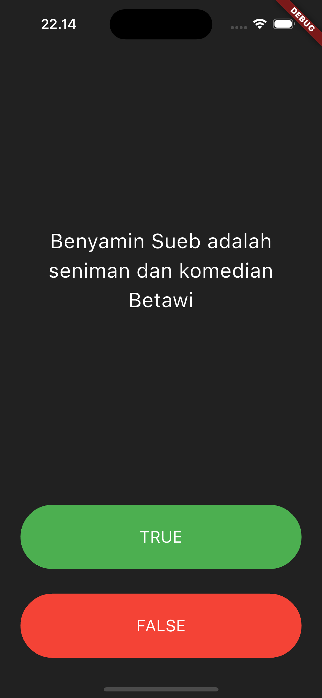
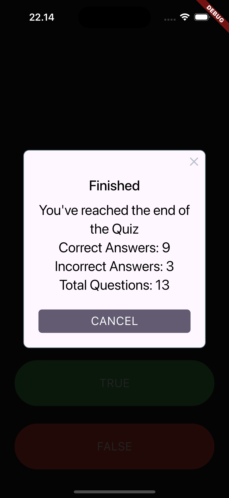

Muhamad Farhan - 4522210057

# Quizzler
Aplikasi ini menampilkan Quiz yang harus dijawab dan akan memberikan total jawaban yang benar ataupun salah di akhir Quiz.

## question.dart
- Berisi kelas untuk merepresentasikan sebuat pertanyaan.
- `questionText`: Merupakan isi dari pertanyaan dan bertipe `string`
- `questionAnswer`: Merupakan jawaban dari pertanyaan dan bertipe `bool` (`true` atau `false`).
- konstruktor `Question({required this.questionText, required this.questionAnswer})`

## quiz_brain.dart
- `_questionNumber`: Nomor pertanyaan saat ini dan dimulai dari 0 dimana itu adalah indeks pertanyaan pertama.
- `_questionBank`: Berisi list daftar pertanyaan lengkap dengan jawaban `true` atau `false`.
- `nextQuestion()`: Method ini digunakan untuk lanjut ke pertanyaan berikutnya.
- `getQuestionText()`: Method ini mengembalikan teks pertanyaan dari pertanyaan saat ini.
- `getCorrectAnswer()`: Method ini mengembalikan jawaban benar dari pertanyaan.
- `isFinished()`: Method ini memeriksa apakah quiz sudah selesai.
- `getTotalQuestions()`: Method untuk menghitung total jumlah pertanyaan.
- `reset()`: Method ini mengatur ulang quiz kembali ke awal.

## main.dart
- Membuat object `QuizBrain`
- `main()`: Fungsi ini menjalankan aplikasi dan `QuizzlerApp`.
- `QuizzlerApp`: Menggunakan `StatelessWidget` yang tidak akan mengubah tampilan dan mengatur tema pada aplikasi ini dengan latar belakang abu-abu gelap.
- `QuizPage`: Menggunakan `StatefulWidget` yang akan mengubah tampilan sesuai interaksi pengguna.
- `scoreKeeper`: Untuk menyimpan riwayat jawabn pengguna menggunakan ikon centang (benar) atau silang (salah).
- `numCorrect` dan `numIncorrect`: Variabel integer untuk menghitung jumlah jawaban benar atau salah.
- `checkAnswer(bool userPickedAnswer)`: Fungsi utama untuk menangani logika saat pengguna menekan tombol TRUE atau FALSE
- `build(BuildContext context)`: Membuat tata letak UI yang dilihat pengguna.

# Screeshot Tampilan
<br>
<br>

# Langkah-Langkah Menjalankan Project
Pastikan kamu sudah menginstall dependensi terlebih dahulu:

```bash
flutter pub get
```

Jalankan aplikasi:

```bash
flutter run
```
